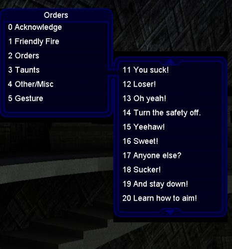
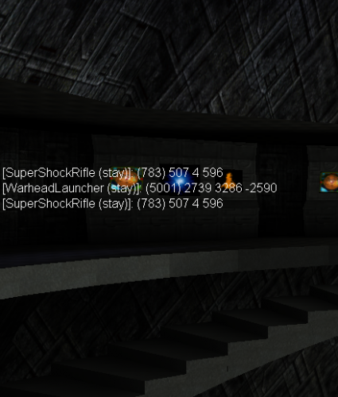

# MH-cheats
Monster Hunt cheats and voice menu fix for UT99

As it turned out, you can modify UTMenu.u and the game does not check its integrity.

This allowed to fix the voice menu and add cheats for Monster Hunt.

Voice Menu:
1. Added numbers in front of menu items.
2. The menu displays 10 items, not 8.
3. Down and up arrows shift the current menu by 10 points up / down, not 1.

This allows you to use keyboard shortcuts to access the entire list of commands.
For example, for Female Voice Two:
4 ↓ ↓ 5 "My house!"

The UTConsole class has been modified to display cheats on Monster Hunt:
1. For weapons: the difference in coordinates is displayed, and type (stationary point, drop or carries by a monster).
2. Reedemer out on separate line.
3. Insta out on separate line.
4. The nearest weapon that is not in inventory is displayed.
5. The coordinates and lives of the nearest monster are displayed.

If you are guiding a Reedemer rocket, then all distances are counted from the rocket.

If you wish, you can even make a mini-radar, or display all this information on an existing radar.

Installation - replace the existing UTMenu.u. This is for UT v436.
